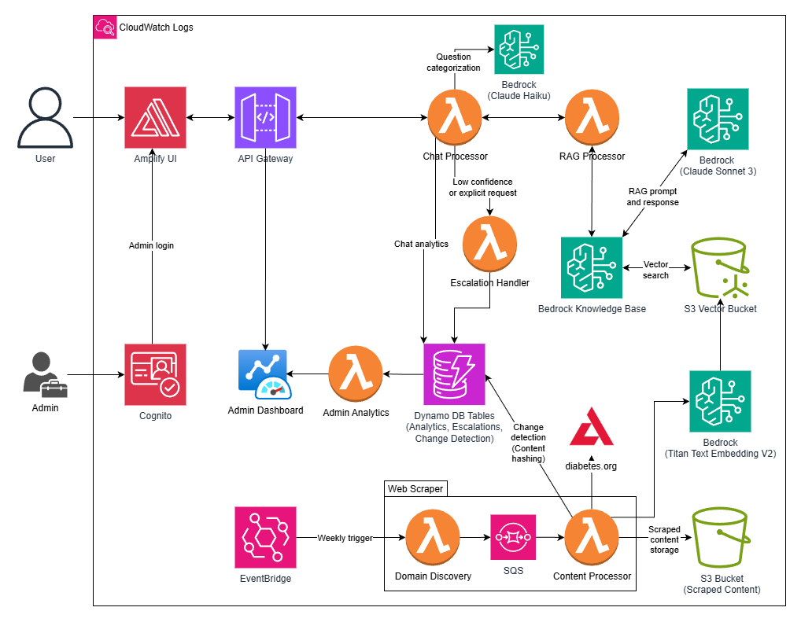

# ADA Clara

An AI-powered diabetes chatbot assistant that provides accurate, evidence-based information about diabetes using trusted American Diabetes Association (ADA) resources, powered by AWS Bedrock and Retrieval Augmented Generation (RAG).

## Demo Video

Watch the complete demonstration of ADA Clara:

  
  
<em>Click the image above to watch the demo</em>

> **[PLACEHOLDER]** Please provide a demo video thumbnail image and save it as `docs/media/demo-thumbnail.png`, and update the video URL link above.

## Index

| Description           | Link                                                  |
| --------------------- | ----------------------------------------------------- |
| Overview              | [Overview](#overview)                                 |
| Architecture          | [Architecture](#architecture-diagram)                 |
| Detailed Architecture | [Detailed Architecture](docs/architectureDeepDive.md) |
| Deployment            | [Deployment](docs/deploymentGuide.md)                 |
| User Guide            | [User Guide](docs/userGuide.md)                       |
| API Documentation     | [API Documentation](docs/APIDoc.md)                   |
| Infrastructure        | [Infrastructure](docs/architectureDeepDive.md)        |
| Modification Guide    | [Modification Guide](docs/modificationGuide.md)      |
| Credits               | [Credits](#credits)                                   |
| License               | [License](#license)                                   |

---

## Overview

This application combines AI-powered conversational AI with intelligent knowledge retrieval to deliver accurate, evidence-based diabetes information. Built on a serverless architecture with RAG (Retrieval Augmented Generation), automated content management, and comprehensive analytics, ADA Clara enables healthcare organizations to provide 24/7 diabetes support with trusted ADA resources.

### Key Features

- **AI-Powered Chatbot** powered by AWS Bedrock with Claude 3 Sonnet
- **RAG System** using Amazon Bedrock Knowledge Base with vector embeddings
- **Multi-Language Support** with language selection and interface localization
- **Automated Knowledge Base** with web scraping from diabetes.org
- **Admin Dashboard** with real-time analytics and conversation insights
- **Escalation Management** for connecting users with healthcare professionals
- **Source Citations** with links to original diabetes.org content
- **Question Analytics** tracking frequently asked and unanswered questions

## Architecture Diagram

The application implements a serverless, event-driven architecture with a RAG-powered AI system at its core, combining automated content processing with intelligent question answering and comprehensive analytics.

For a detailed deep dive into the architecture, including core principles, component interactions, data flow, security, and implementation details, see [docs/architectureDeepDive.md](docs/architectureDeepDive.md).

## User Flow

For a detailed overview of the user journey and application workflow, including step-by-step user interactions, see [docs/userGuide.md](docs/userGuide.md).

## Deployment

For detailed deployment instructions, including prerequisites and step-by-step guides, see [docs/deploymentGuide.md](docs/deploymentGuide.md).

## Usage

For detailed backend testing and usage instructions, including configuration steps and how to test the application from AWS Console, see [docs/userGuide.md](docs/userGuide.md).

For frontend user guide and application features, see [docs/userGuide.md](docs/userGuide.md).

## Infrastructure

For a detailed overview of the application infrastructure, including component interactions, AWS services, and data flow, see [docs/architectureDeepDive.md](docs/architectureDeepDive.md).

## Documentation

- **[API Documentation](docs/APIDoc.md)** - Comprehensive API reference for all endpoints
- **[Architecture Deep Dive](docs/architectureDeepDive.md)** - Detailed system architecture and design

## Modification Guide

Steps to implement optional modifications such as changing the Bedrock model, adding new features, or customizing the frontend can be found [here](docs/modificationGuide.md).

---

## Credits

This application was architected and developed by [Shaashvat Mittal](https://www.linkedin.com/in/shaashvatm156/), [Sean Sannier](https://www.linkedin.com/in/sean-sannier-565889381/), and [Omdevsinh Zala](https://www.linkedin.com/in/omdevsinhzala/) with solutions architect [Arun Arunachalam](https://www.linkedin.com/in/arunarunachalam/), program manager [Thomas Orr](https://www.linkedin.com/in/thomas-orr/) and product manager [Rachel Hayden](https://www.linkedin.com/in/rachelhayden/). Thanks to the ASU Cloud Innovation Center Technical and Project Management teams for their guidance and support.

---

## License

See [LICENSE](LICENSE) file for details.