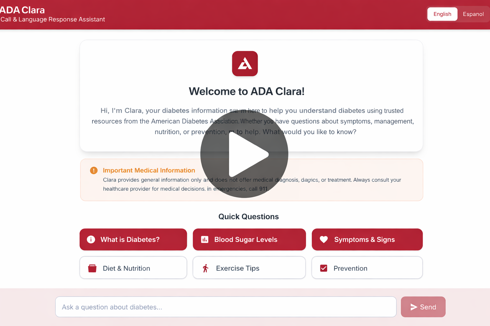
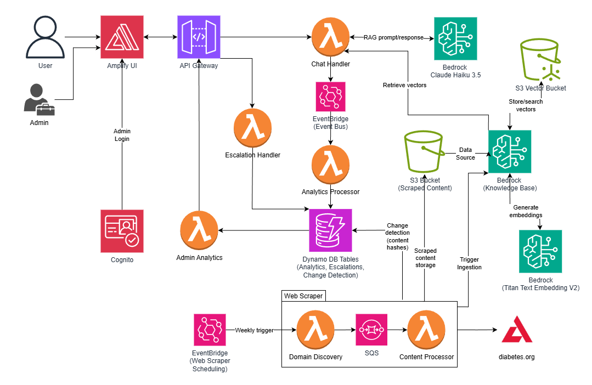

# ADA Clara

An AI-powered diabetes chatbot assistant that provides accurate, evidence-based information about diabetes using trusted American Diabetes Association (ADA) resources, powered by AWS Bedrock and Retrieval Augmented Generation (RAG).

## Demo Video

Watch the complete demonstration of ADA Clara:

<div align="center">
  <a href="https://drive.google.com/file/d/1mrBAhw4bXFlNrgvHk-Jm0gcBxuISawcr/preview">
    
  </a>
  <p><em>Click the image above to watch the demo (opens in Google Drive)</em></p>
</div>

## Index

| Description           | Link                                                  |
| --------------------- | ----------------------------------------------------- |
| Overview              | [Overview](#overview)                                 |
| Technology Stack      | [Technology Stack](#technology-stack)                 |
| Architecture          | [Architecture](#architecture-diagram)                 |
| Prerequisites         | [Prerequisites](#prerequisites)                       |
| Deployment            | [Deployment](#deployment)                             |
| Project Structure     | [Project Structure](#project-structure)               |
| Configuration         | [Configuration](#configuration)                       |
| User Guide            | [User Guide](docs/userGuide.md)                       |
| Detailed Architecture | [Detailed Architecture](docs/architectureDeepDive.md) |
| API Documentation     | [API Documentation](docs/APIDoc.md)                   |
| Modification Guide    | [Modification Guide](docs/modificationGuide.md)      |
| Deployment Guide      | [Deployment Guide](docs/deploymentGuide.md)           |
| Credits               | [Credits](#credits)                                   |
| License               | [License](#license)                                   |

---

## Overview

This application combines AI-powered conversational AI with intelligent knowledge retrieval to deliver accurate, evidence-based diabetes information. Built on a serverless architecture with RAG (Retrieval Augmented Generation), automated content management, and comprehensive analytics, ADA Clara enables healthcare organizations to provide 24/7 diabetes support with trusted ADA resources.

### Key Features

- **AI-Powered Chatbot** powered by AWS Bedrock with Claude Haiku 4.5 (inference profile: `us.anthropic.claude-haiku-4-5-20251001-v1:0`)
- **RAG System** using Amazon Bedrock Knowledge Base with Titan Text Embedding V2 (1024-dimensional embeddings)
- **Daily Session Management** with automatic session rotation at midnight (100 messages per session)
- **Intelligent Escalation** with confidence scoring (0.70 threshold) and rate limiting (3 submissions per email per 60 minutes)
- **Multi-Language Support** with automatic language detection and interface localization (English/Spanish)
- **Automated Knowledge Base** with weekly web scraping from diabetes.org (Sundays 2 AM UTC, ~1,200 pages)
- **Admin Dashboard** with real-time analytics, conversation insights, and trend analysis
- **6 Specialized Lambda Functions** for chat, analytics, escalation, and content processing (all Node.js 24.x)
- **Source Citations** with verified diabetes.org links and content deduplication
- **Question Analytics** tracking frequently asked questions, unanswered queries, and user engagement patterns

### Technology Stack

**Frontend**
- Next.js 16.1.1 (App Router)
- React 19.2.0
- TypeScript 5
- Tailwind CSS 4
- AWS Amplify (hosting)

**Backend**
- AWS CDK 2.233.0 (Infrastructure as Code)
- Node.js 24.x runtime (all Lambda functions)
- TypeScript 5.6.3 (CDK stack)
- JavaScript (Lambda handlers)

**AI & Machine Learning**
- Claude Haiku 4.5 (`us.anthropic.claude-haiku-4-5-20251001-v1:0`)
- Titan Text Embedding V2 (`amazon.titan-embed-text-v2:0`)
- 1024-dimensional vector embeddings

**Database & Storage**
- DynamoDB (3 tables: data-table, escalation-requests, content-tracking)
- S3 (content storage, vector embeddings)
- 30-day TTL (data-table), 90-day TTL (escalation-requests)

**API & Integration**
- HTTP API Gateway v2 (not REST API)
- AWS Cognito (JWT authorization for admin endpoints)
- EventBridge (weekly KB scraping schedule)
- SQS (URL batch processing with DLQ)

**Lambda Functions (All Node.js 24.x)**
1. **chat-handler** (1536MB, 5min) - Main chat processing with integrated RAG
2. **analytics-processor** (512MB, 60s) - Async analytics + public API endpoints
3. **admin-analytics** (512MB, 30s) - Admin dashboard data aggregation
4. **escalation-handler** (512MB, 30s) - Form processing with rate limiting
5. **domain-discovery** (1024MB, 15min) - URL discovery from diabetes.org
6. **content-processor** (1024MB, 15min) - Web scraping + Knowledge Base ingestion

## Architecture Diagram



The application implements a serverless, event-driven architecture with a RAG-powered AI system at its core, combining automated content processing with intelligent question answering and comprehensive analytics.

For a detailed deep dive into the architecture, including core principles, component interactions, data flow, security, and implementation details, see [docs/architectureDeepDive.md](docs/architectureDeepDive.md).

## User Flow

For a detailed overview of the user journey and application workflow, including step-by-step user interactions, see [docs/userGuide.md](docs/userGuide.md).

## Prerequisites

Before deploying ADA Clara, ensure you have the following:

**AWS Requirements**
- AWS Account with AdministratorAccess or equivalent permissions
- **🚨 CRITICAL: Anthropic Model Access in AWS Bedrock** (Request approval 1-2 business days before deployment)
  - Navigate to [AWS Bedrock Console](https://console.aws.amazon.com/bedrock/)
  - Go to "Model access" in the left sidebar
  - Request access to "Anthropic" models (specifically Claude Haiku 4.5)
  - Wait for approval (typically 1-2 business days)
  - ⚠️ **Deployment will fail without this prerequisite**

**No Local Dependencies Required**
- All deployment happens in AWS CloudShell
- No local Node.js, CDK, or other tools needed

## Deployment

Deploying ADA Clara is simple and requires no local dependencies. Everything can be done from AWS CloudShell:

1. Open AWS Console and start CloudShell
2. Clone the repository: `git clone https://github.com/ASUCICREPO/ADA-Clara.git`
3. Navigate to the project: `cd ADA-Clara`
4. Make the script executable: `chmod +x deploy.sh`
5. Run the deployment: `./deploy.sh`

The deployment script handles everything automatically, including:
- Backend infrastructure (CDK stack with 6 Lambda functions, DynamoDB, S3, API Gateway)
- Frontend deployment via AWS CodeBuild and Amplify
- Knowledge Base creation and automatic population (~1,200 URLs from diabetes.org)
- EventBridge schedule for weekly content updates

**Deployment Timeline**: 30-40 minutes total
- Backend CDK deployment: ~10-15 minutes
- Frontend CodeBuild: ~15-20 minutes
- Knowledge Base population: ~5-10 minutes (asynchronous)

For detailed instructions, troubleshooting, and post-deployment verification, see [docs/deploymentGuide.md](docs/deploymentGuide.md).

## Project Structure

```
├── backend/
│   ├── lib/
│   │   └── ada-clara-unified-stack.ts    # Unified CDK stack (all infrastructure)
│   ├── lambda/                           # 6 Lambda functions (JavaScript, Node.js 24.x)
│   │   ├── chat-handler/                 # Main chat + integrated RAG
│   │   ├── analytics-processor/          # Async analytics + public endpoints
│   │   ├── admin-analytics/              # Admin dashboard data
│   │   ├── escalation-handler/           # Form processing + rate limiting
│   │   ├── domain-discovery/             # URL discovery from diabetes.org
│   │   └── content-processor/            # Web scraping + KB ingestion
│   ├── package.json                      # CDK dependencies
│   └── cdk.json                          # CDK configuration
├── frontend/
│   ├── app/                              # Next.js 16 App Router
│   │   ├── components/                   # React components
│   │   ├── admin/                        # Admin dashboard pages
│   │   │   ├── page.tsx                  # Dashboard
│   │   │   └── login/page.tsx            # Admin login
│   │   ├── lib/                          # Utilities and API clients
│   │   └── page.tsx                      # Main chat page
│   ├── public/                           # Static assets
│   ├── package.json                      # Frontend dependencies
│   └── amplify.yml                       # Amplify build configuration
├── docs/                                 # Comprehensive documentation
│   ├── architectureDeepDive.md           # Detailed architecture
│   ├── deploymentGuide.md                # Deployment instructions
│   ├── userGuide.md                      # User guide
│   ├── modificationGuide.md              # Customization guide
│   ├── APIDoc.md                         # API documentation
├── buildspec.yml                         # CodeBuild specification for frontend
├── deploy.sh                             # Unified deployment script
└── README.md                             # This file
```

## Configuration

### RAG Configuration
- **Retrieval Chunks**: 5 documents per query (`MAX_RETRIEVAL_RESULTS`)
- **Minimum Relevance Score**: 0.65 (`MIN_RELEVANCE_SCORE`)
- **Confidence Threshold**: 0.70 - triggers escalation if lower (`CONFIDENCE_THRESHOLD`)
- **Chunking Strategy**: 512 tokens with 30% overlap
- **Embedding Dimensions**: 1024 (Titan Text Embedding V2)

### Session Management
- **Persistence**: Daily rotation (resets at midnight local time)
- **Message Limit**: 100 messages per session
- **Character Limit**: 5,000 characters per message
- **Storage**: localStorage with 30-day DynamoDB TTL
- **Implementation**: See [docs/kiroDocs/SESSION_PERSISTENCE.md](docs/kiroDocs/SESSION_PERSISTENCE.md)

### Escalation System
- **Automatic Trigger**: Confidence score < 0.70
- **Semantic Detection**: Claude LLM analyzes user intent
- **Manual Trigger**: User request patterns (e.g., "talk to a person")
- **Rate Limiting**: 3 submissions per email per 60 minutes
- **Data Retention**: 90-day TTL in DynamoDB

### Knowledge Base
- **Update Schedule**: Weekly (Sundays at 2 AM UTC via EventBridge)
- **Content Source**: diabetes.org (~1,200 pages)
- **Quality Threshold**: 50 (0-100 scale for content quality assessment)
- **Change Detection**: SHA-256 hashing to detect content updates
- **Target Domain**: `TARGET_DOMAIN: 'diabetes.org'`

### Lambda Configuration
All Lambda functions use:
- **Runtime**: Node.js 24.x (`NODEJS_24_X`)
- **Architecture**: x86_64
- **Timeout**: Varies by function (30s to 15min)
- **Memory**: 512MB to 1536MB depending on workload
- **Logging**: CloudWatch Logs with 7-day retention

For detailed modification instructions, see [docs/modificationGuide.md](docs/modificationGuide.md).

## Usage

For detailed backend testing and usage instructions, including configuration steps and how to test the application from AWS Console, see [docs/userGuide.md](docs/userGuide.md).

For frontend user guide and application features, see [docs/userGuide.md](docs/userGuide.md).

## Infrastructure

For a detailed overview of the application infrastructure, including component interactions, AWS services, and data flow, see [docs/architectureDeepDive.md](docs/architectureDeepDive.md).

## Documentation

- **[API Documentation](docs/APIDoc.md)** - Comprehensive API reference for all endpoints
- **[Architecture Deep Dive](docs/architectureDeepDive.md)** - Detailed system architecture and design

## Modification Guide

Steps to implement optional modifications such as changing the Bedrock model, adding new features, or customizing the frontend can be found [here](docs/modificationGuide.md).

---


## Credits

This application was architected and developed by [Shaashvat Mittal](https://www.linkedin.com/in/shaashvatm156/), [Sean Sannier](https://www.linkedin.com/in/sean-sannier-565889381/), and [Omdevsinh Zala](https://www.linkedin.com/in/omdevsinhzala/) with solutions architect [Arun Arunachalam](https://www.linkedin.com/in/arunarunachalam/), program manager [Thomas Orr](https://www.linkedin.com/in/thomas-orr/) and product manager [Rachel Hayden](https://www.linkedin.com/in/rachelhayden/). Thanks to the ASU Cloud Innovation Center Technical and Project Management teams for their guidance and support.

---

## License

See [LICENSE](LICENSE) file for details.