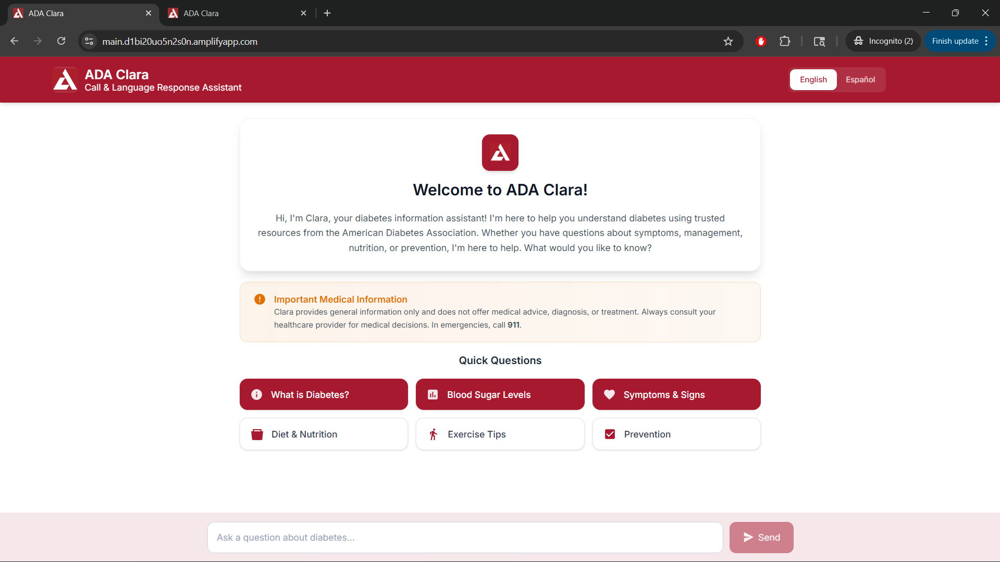
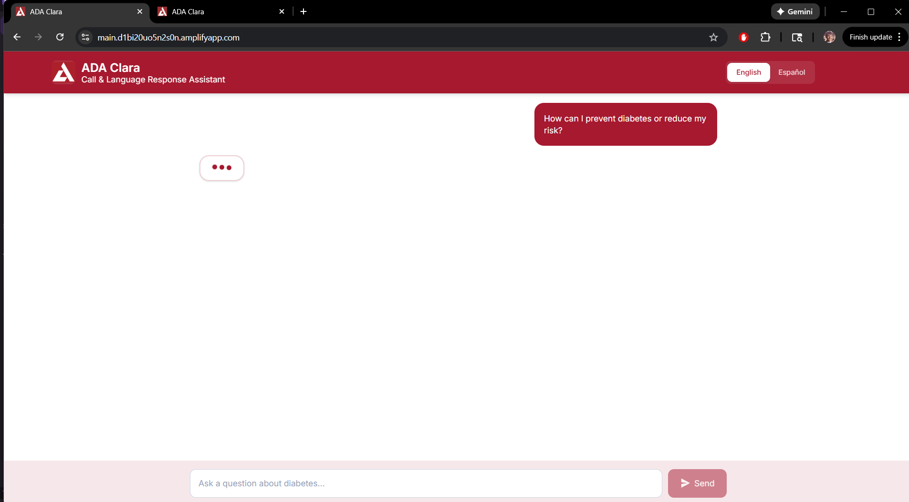
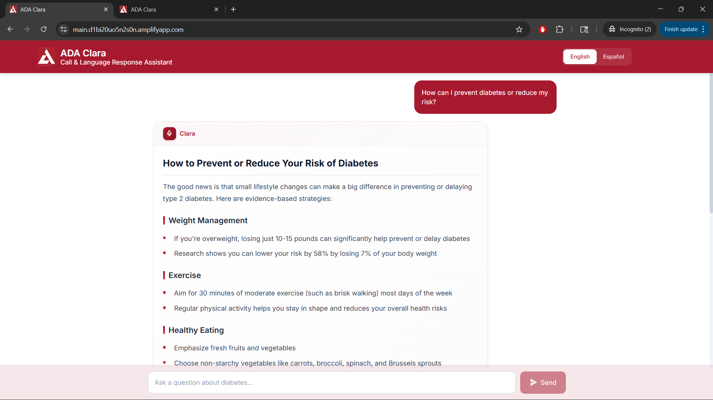
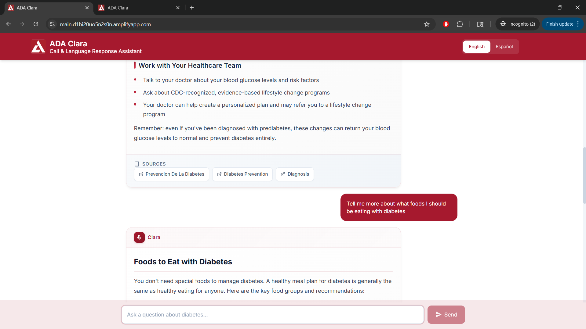
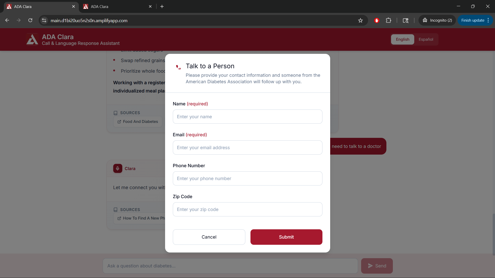
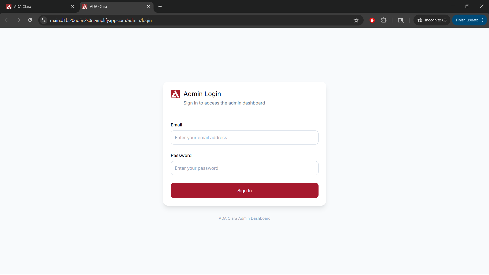
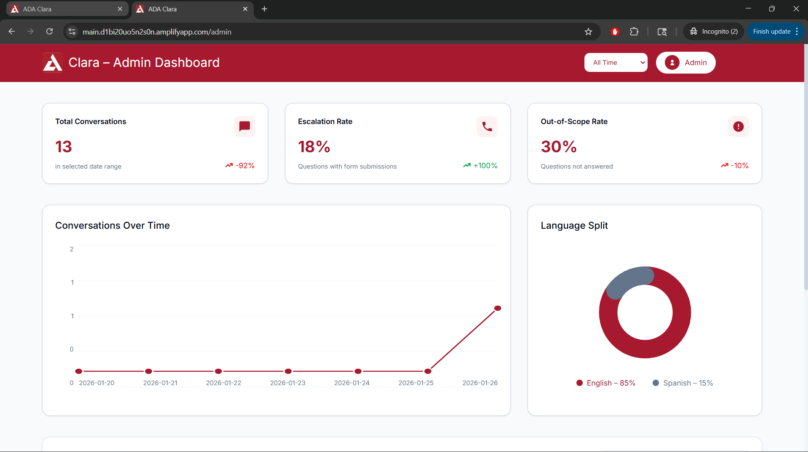
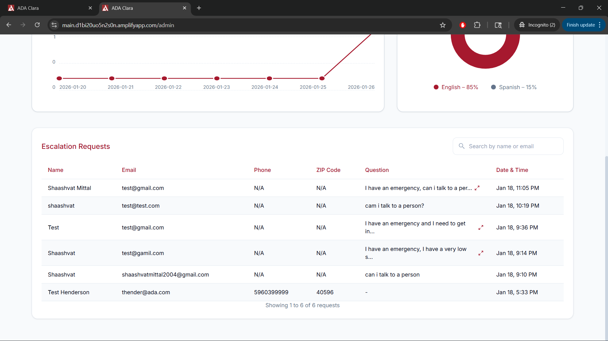

**Project Completion Documentation** 

ADA Clara - AI-Powered Diabetes Chatbot

 

**Authors:** 

**Shaashvat Mittal, Sean Sannier, Omdevsinh Zala**

**Project Closure Date:**

**January 26, 2026**

### 

**Table of Contents**

**1[. Executive Summary](#1-executive-summary)**

**2[. Project Overview](#2-project-overview)**

2[.1 AWS Leads](#21-aws-leads)

2[.2 ASU Build Team](#22-asu-build-team)

2[.3 Project Timeline](#23-project-timeline)

2[.4 Project Timeline and Sprints](#24-project-timeline-and-sprints)

[**3\. Project Performance**](#3-project-performance)

[3.1 Problem Statement](#31-problem-statement)

[3.2 Project Scope](#32-project-scope)

[3.3 Deliverables](#33-deliverables)

[**4\. Development**](#4-development)

[4.1 UI/UX](#41-uiux)

[4.2 System Architecture](#42-system-architecture)

[4.3 Technology Stack](#43-technology-stack)

[4.4 Key Features Implementation](#44-key-features-implementation)

[4.5 Deployment](#45-deployment)

[**5\. Challenges**](#5-challenges)

[**6\. Future Scope**](#6-future-scope)

[**7\. Appendix**](#7-appendix)

### 

### **1\. Executive Summary** {#1-executive-summary}

### ---

The American Diabetes Association (ADA) serves millions of people affected by diabetes across the United States, providing critical education, resources, and support for diabetes management and prevention. With diabetes affecting over 38 million Americans and 98 million more at risk for prediabetes, there is an urgent need for accessible, accurate, and evidence-based diabetes information available 24/7. Traditional support channels face limitations in scalability, availability, and the ability to provide instant responses to the diverse questions people have about diabetes management, nutrition, symptoms, and treatment options.

To address these challenges, ADA Clara was developed as an AI-powered diabetes chatbot assistant that provides accurate, evidence-based information using trusted American Diabetes Association resources. Built on AWS serverless architecture with Amazon Bedrock and Retrieval Augmented Generation (RAG), the solution combines automated content management with intelligent question answering to deliver 24/7 diabetes support. ADA Clara leverages Claude Haiku 4.5 for natural language understanding and Titan Text Embedding V2 for semantic search across 1,200+ pages of diabetes.org content, enabling users to receive instant, contextual answers with verified source citations.

Key features include AI-powered conversational responses with confidence scoring, multi-language support (English/Spanish), intelligent escalation to healthcare professionals when needed, automated weekly knowledge base updates from diabetes.org, comprehensive admin analytics dashboard, and daily session management with up to 100 messages per session. The system implements a sophisticated RAG pipeline with query preprocessing, relevance scoring (minimum 0.65 threshold), and hybrid confidence calculation that considers source quality, diversity, and volume to ensure response accuracy.

The successful implementation of ADA Clara enhances the American Diabetes Association's ability to scale diabetes education and support while improving accessibility for diverse communities. By providing instant access to trusted information with source citations, implementing intelligent escalation for complex medical questions, and offering comprehensive analytics for continuous improvement, the platform empowers individuals affected by diabetes to make informed decisions about their health. Ultimately, ADA Clara strengthens the ADA's capacity to fulfill its mission of preventing and curing diabetes while improving the lives of all people affected by the disease.

### 

### **2\. Project Overview**

---

 {#2-project-overview}

#### **2.1 AWS Leads** {#21-aws-leads}

- Colleen Schwab - Digital Innovation Lead
- Arun Arunachalam – Solution Architect
- Tom Orr – Program Manager

#### **2.2 ASU Build Team** {#22-asu-build-team}

- Shaashvat Mittal – Frontend Developer
- Sean Sannier – Backend Developer
- Omdevsinh Zala – UI/UX Designer
- Rachel Hayden – Product Manager

#### **2.3 Project Timeline** {#23-project-timeline}

16-Dec-2025 - 26-Jan-2026

#### **2.4 Project Timeline and Sprints** {#24-project-timeline-and-sprints}

| Item # | Iterations | Deliverables | Date planned |
| :---- | :---- | :---- | :---- |
| **1** | **Pre POC** | Requirements gathering, architecture design, AWS account setup | **Before 12/16/25** |
| **2** | **Week 1** | Backend infrastructure setup, Lambda functions development, DynamoDB schema design | **12/16/25 - 12/22/25** |
| **3** | **Week 2** | RAG implementation, Bedrock Knowledge Base integration, web scraping pipeline | **12/23/25 - 12/29/25** |
| **4** | **Week 3** | Frontend development, chat interface, language support | **12/30/25 - 01/05/26** |
| **5** | **Week 4** | Admin dashboard, analytics implementation, escalation system | **01/06/26 - 01/12/26** |
| **6** | **Week 5** | Testing, documentation, deployment automation | **01/13/26 - 02/19/26** |
| **7** | **Week 6** | Internal code reviews, updates | **01/20/26 - 01/26/26** |

### 

### **3\. Project Performance** {#3-project-performance}

### ---

### 

#### **3.1 Problem Statement** {#31-problem-statement}

The American Diabetes Association faces significant challenges in providing timely, accurate diabetes information to millions of people affected by the disease. With over 38 million Americans living with diabetes and 98 million more at risk for prediabetes, the demand for reliable diabetes education and support far exceeds the capacity of traditional support channels. Current limitations include restricted availability (business hours only), scalability constraints (limited staff to handle growing inquiries), language barriers (primarily English-only support), and delayed response times for common questions that could be answered immediately with the right technology.

Users seeking diabetes information often struggle to navigate extensive online resources, find relevant answers quickly, or determine which sources are trustworthy. The diabetes.org website contains over 1,200 pages of valuable content, but users may not know where to look or how to find specific information efficiently. Additionally, there is no automated way to identify when questions require escalation to healthcare professionals versus when they can be answered with educational content, leading to inefficient use of staff resources and potential delays in critical situations.

The organization needed an intelligent, scalable solution that could provide instant access to trusted diabetes information 24/7, support multiple languages to serve diverse communities, automatically identify and escalate complex medical questions, maintain up-to-date content from diabetes.org, provide analytics to understand user needs and improve services, and reduce the burden on staff while improving response quality and consistency. Without such a solution, the ADA risked being unable to meet the growing demand for diabetes education and support, potentially impacting health outcomes for millions of people.

#### **3.2 Project Scope** {#32-project-scope}

##### **In Scope**

- AI-powered chatbot using Amazon Bedrock with Claude Haiku 4.5
- RAG system with Bedrock Knowledge Base and Titan Text Embedding V2
- Automated web scraping from diabetes.org (1,200+ pages)
- Weekly knowledge base updates via EventBridge scheduling
- Multi-language support (English and Spanish)
- Daily session management with 100 messages per session
- Intelligent escalation system with confidence scoring
- Rate-limited escalation form (3 submissions per email per 60 minutes)
- Admin dashboard with real-time analytics
- Source citations with verified diabetes.org links
- 6 specialized Lambda functions for chat, analytics, escalation, and content processing
- Serverless architecture with AWS CDK deployment
- DynamoDB storage with TTL (30-day for sessions, 90-day for escalations)
- Cognito authentication for admin access
- Amplify hosting for Next.js frontend
- Comprehensive documentation (API, architecture, deployment, user guide)

##### **Out of Scope**

- Real-time chat with human healthcare professionals
- Medical diagnosis or treatment recommendations
- Integration with electronic health records (EHR) systems
- Mobile native applications (iOS/Android)
- Voice interface or speech recognition
- Integration with wearable devices or glucose monitors
- Personalized treatment plans or medication management
- HIPAA-compliant patient data storage
- Languages beyond English and Spanish

#### **3.3 Deliverables** {#33-deliverables}

- Functional AI-powered chatbot web application
- AWS serverless infrastructure deployed via CDK
- 6 Lambda functions (Node.js 24.x):
  - chat-handler (main chat + integrated RAG)
  - analytics-processor (async analytics + public endpoints)
  - admin-analytics (dashboard data aggregation)
  - escalation-handler (form processing + rate limiting)
  - domain-discovery (URL discovery from diabetes.org)
  - content-processor (web scraping + KB ingestion)
- Bedrock Knowledge Base with 1,200+ diabetes.org pages
- DynamoDB tables (data-table, escalation-requests, content-tracking)
- Admin dashboard with analytics and escalation management
- Multi-language support (English/Spanish)
- Automated weekly content updates via EventBridge
- Source code and configuration files
- Comprehensive documentation:
  - API Documentation
  - Architecture Deep Dive
  - Deployment Guide
  - User Guide
  - Modification Guide
- Deployment automation script (deploy.sh)
- Demo video and presentation materials

### 

### **4\. Development** {#4-development}

---

#### 

#### **4.1 UI/UX** {#41-uiux}

#### ---

#### 

#### **Who are the users of this application?**

The primary users of ADA Clara are individuals affected by diabetes, including people living with type 1 or type 2 diabetes, those at risk for prediabetes, family members and caregivers seeking information to support loved ones, and healthcare educators looking for reliable resources to share with patients. Secondary users include ADA staff and administrators who need to monitor system performance, analyze user engagement patterns, and manage escalation requests.

Users range from newly diagnosed individuals seeking basic information about diabetes management to experienced patients looking for specific guidance on nutrition, exercise, or medication. The application serves a diverse demographic including different age groups, language preferences (English and Spanish speakers), and varying levels of health literacy. Admin users require secure access to analytics dashboards and escalation management tools to support operational decision-making and continuous improvement.

#### **Why are the users using this application?**

Users come to ADA Clara to get instant, reliable answers to their diabetes-related questions without waiting for business hours or navigating through extensive website content. They need quick access to trusted information from the American Diabetes Association to make informed decisions about diabetes management, understand symptoms and treatment options, learn about nutrition and lifestyle modifications, and determine when they need to consult with healthcare professionals.

The application addresses the critical need for 24/7 diabetes support that is accessible, accurate, and easy to use. Users benefit from conversational AI that understands their questions in natural language, provides contextual answers with source citations, and offers escalation options when questions require professional medical guidance. Admin users leverage the platform to gain insights into common user questions, identify knowledge gaps, monitor escalation patterns, and improve the quality of diabetes education resources.

#### **What is the customer opportunity statement?**

The American Diabetes Association needed a scalable, intelligent solution to provide instant access to trusted diabetes information for millions of people affected by the disease. With over 1,200 pages of valuable content on diabetes.org but limited staff capacity to answer individual questions, there was a significant opportunity to leverage AI technology to democratize access to diabetes education while maintaining the quality and trustworthiness that users expect from the ADA.

This presents an opportunity to transform how people access diabetes information by combining the ADA's authoritative content with advanced AI capabilities, enabling 24/7 support that scales effortlessly, reduces response times from hours to seconds, supports multiple languages to serve diverse communities, and provides data-driven insights to continuously improve diabetes education. By implementing ADA Clara, the organization can extend its reach, improve user satisfaction, and ultimately contribute to better health outcomes for people affected by diabetes.

#### **User Interface**

> Landing page with chat interface and language switcher

> User asking a question about diabetes symptoms

> AI-generated response with source citations from diabetes.org

> Follow-up question maintaining conversation context

> Escalation form for users needing to speak with healthcare professionals

> Admin authentication via Cognito

> Admin dashboard showing conversation analytics and metrics

> Escalation requests management interface

#### 

#### **4.2 System Architecture** {#42-system-architecture}

ADA Clara implements a serverless, event-driven architecture with a RAG-powered AI system at its core, combining automated content processing with intelligent question answering and comprehensive analytics. The system is built entirely on AWS services, leveraging Lambda functions for compute, DynamoDB for data storage, S3 for content and vector embeddings, and Amazon Bedrock for AI capabilities.

##### **Architecture Diagram**

##### **Workflow Description**

**User Chat Flow:**

1. **User Interaction** - Users access the chatbot through the Amplify-hosted Next.js interface and type questions about diabetes in their preferred language (English or Spanish)

2. **Request Processing** - User messages are sent via HTTPS to HTTP API Gateway v2, which routes POST requests to the `/chat` endpoint with CORS support and authentication handling

3. **Chat Processing & RAG** - The chat-handler Lambda function performs integrated RAG processing:
   - Retrieves or creates chat session from DynamoDB
   - Preprocesses query (expands diabetes abbreviations like T1D→Type 1 diabetes)
   - Queries Bedrock Knowledge Base with expanded query
   - Bedrock performs vector search on S3 Vectors index
   - Retrieves 5 most relevant content chunks with relevance scores
   - Applies hybrid confidence scoring (top score if ≥0.79, otherwise average of quality sources ≥0.65)
   - Invokes Claude Haiku 4.5 to generate contextual responses
   - Returns response with source citations from diabetes.org

4. **Escalation Handling** - Escalation is triggered by low confidence (≤0.70), semantic detection by Claude LLM, or explicit user request. Chat-handler directly writes escalation records to DynamoDB

5. **Analytics Processing** - Chat-handler asynchronously invokes analytics-processor Lambda (fire-and-forget) to update session activity, record questions, and track metrics

6. **Response Delivery** - Generated response is stored in DynamoDB and returned to user through API Gateway with message, sources, confidence score, and escalation status

**Admin Flow:**

1. **Admin Authentication** - Admin users log in via Cognito User Pool, receiving JWT tokens for API authentication

2. **Dashboard Access** - Authenticated admins access the dashboard through Amplify UI with protected routes

3. **Analytics Retrieval** - Admin-analytics Lambda queries DynamoDB tables to provide conversation metrics, escalation rates, 7-day conversation charts, and language distribution

4. **Escalation Management** - Escalation-handler Lambda provides paginated access to user-submitted forms and auto-escalated conversations

**Content Management Flow:**

1. **Weekly Trigger** - EventBridge triggers domain-discovery Lambda every Sunday at 2 AM UTC

2. **URL Discovery** - Domain-discovery crawls diabetes.org sitemap and seed URLs, filters and prioritizes content (0-100 scoring), creates batches of 15 URLs, and sends to SQS queue

3. **Content Processing** - Content-processor Lambda (SQS-triggered) converts HTML to Markdown, performs quality assessment (minimum score 50), detects content changes via SHA-256 hashing, stores .md files in S3, and triggers Bedrock KB ingestion

4. **Knowledge Base Update** - Bedrock automatically ingests new content, creates vector embeddings using Titan Text Embedding V2, and updates the S3 Vectors index for semantic search

#### 

#### **4.3 Technology Stack** {#43-technology-stack}

##### **Frontend**
- **Next.js 16.1.1**: React framework with App Router for page routing and server-side rendering
- **React 19.2.0**: UI component library for interactive chat interface
- **TypeScript 5**: Type-safe development
- **Tailwind CSS 4**: Utility-first CSS framework for responsive design
- **Hosting**: AWS Amplify with automatic builds and CDN distribution

##### **Backend Services**
- **AWS Lambda (Node.js 24.x)**: 6 specialized serverless functions
  - chat-handler (1536MB, 5min timeout)
  - analytics-processor (512MB, 60s timeout)
  - admin-analytics (512MB, 30s timeout)
  - escalation-handler (512MB, 30s timeout)
  - domain-discovery (1024MB, 15min timeout)
  - content-processor (1024MB, 15min timeout)
- **HTTP API Gateway v2**: RESTful API with CORS support and Cognito JWT authorization
- **AWS EventBridge**: Weekly scheduling for knowledge base updates (Sundays 2 AM UTC)
- **Amazon SQS**: URL batch processing queue with Dead Letter Queue (DLQ)

##### **Data Storage**
- **Amazon DynamoDB**: 3 tables with on-demand billing
  - data-table (sessions, messages, questions, analytics) - 30-day TTL
  - escalation-requests (user forms, auto-escalations) - 90-day TTL
  - content-tracking (web scraping progress, content changes) - 90-day TTL
- **Amazon S3**: 2 buckets for content and vector storage
  - Content bucket (Markdown files from diabetes.org)
  - Vectors bucket (1024-dimensional embeddings)

##### **AI/ML Services**
- **Amazon Bedrock**: Foundation model service
  - Claude Haiku 4.5 (us.anthropic.claude-haiku-4-5-20251001-v1:0) for response generation
  - Titan Text Embedding V2 (amazon.titan-embed-text-v2:0) for vector embeddings
- **Bedrock Knowledge Base**: RAG system with semantic search
  - 1,200+ pages from diabetes.org
  - 512-token chunks with 30% overlap
  - Cosine similarity for vector search

##### **Infrastructure**
- **AWS CDK 2.233.0**: Infrastructure as Code in TypeScript
- **Amazon Cognito**: User authentication (User Pool, Identity Pool, JWT authorization)
- **AWS CloudWatch**: Logging and monitoring with 7-day retention

#### 

#### **4.4 Key Features Implementation** {#44-key-features-implementation}

##### **Feature 1: Integrated RAG Pipeline**

The RAG (Retrieval Augmented Generation) system is fully integrated into the chat-handler Lambda function, eliminating the need for separate retrieval and generation steps. The implementation includes:

- **Query Preprocessing**: Expands diabetes abbreviations (T1D→Type 1 diabetes, T2D→Type 2 diabetes, BG→blood glucose) to improve retrieval accuracy
- **Vector Search**: Queries Bedrock Knowledge Base with preprocessed query, retrieving up to 5 most relevant chunks from 1,200+ diabetes.org pages
- **Relevance Filtering**: Applies minimum relevance score of 0.65 to ensure quality sources
- **Hybrid Confidence Scoring**: Uses top score if ≥0.79, otherwise averages quality sources ≥0.65, with penalties for <2 sources and bonuses for ≥4 sources
- **Response Generation**: Invokes Claude Haiku 4.5 with retrieved context to generate accurate, contextual answers
- **Source Attribution**: Extracts and returns verified diabetes.org URLs with relevance scores for transparency

##### **Feature 2: Intelligent Escalation System**

The escalation system automatically identifies when questions require human intervention through multiple detection methods:

- **Confidence-Based Escalation**: Triggers when confidence score ≤0.70, indicating insufficient information or ambiguous questions
- **Semantic Detection**: Claude LLM analyzes user intent and responds with "ESCALATE_TO_HUMAN" for emergency situations or medical advice requests
- **User-Initiated Escalation**: Regex patterns detect explicit requests like "talk to a person", "speak to doctor", "need help from human"
- **Direct DynamoDB Writes**: Chat-handler writes escalation records directly to escalation-requests table without separate Lambda invocation
- **Rate Limiting**: Prevents spam with 3 submissions per email per 60 minutes
- **PII Redaction**: Automatically redacts sensitive information from escalation records
- **90-Day Retention**: TTL ensures escalation data is automatically deleted after 90 days

##### **Feature 3: Automated Knowledge Base Management**

The content management system automatically maintains an up-to-date knowledge base through weekly web scraping:

- **EventBridge Scheduling**: Triggers domain-discovery Lambda every Sunday at 2 AM UTC
- **URL Discovery**: Crawls diabetes.org sitemap and seed URLs, discovering 1,200+ pages
- **Content Prioritization**: Scores URLs 0-100 based on content type (articles, guides, FAQs prioritized over news)
- **Batch Processing**: Creates batches of 15 URLs sent to SQS queue for parallel processing
- **HTML to Markdown Conversion**: Content-processor converts HTML to clean Markdown format
- **Quality Assessment**: Evaluates content quality (0-100 scale), rejecting content with score <50
- **Change Detection**: Uses SHA-256 hashing to detect content updates and avoid reprocessing unchanged pages
- **Automatic Ingestion**: Triggers Bedrock KB ingestion on TRIGGER_INGESTION sentinel message
- **Vector Embedding**: Titan Text Embedding V2 creates 1024-dimensional embeddings for semantic search

##### **Feature 4: Comprehensive Admin Analytics**

The admin dashboard provides real-time insights into system performance and user engagement:

- **Conversation Metrics**: Total conversations with week-over-week trends
- **Escalation Rate**: Percentage of user-submitted escalation forms
- **Out-of-Scope Rate**: Percentage of questions auto-escalated due to low confidence
- **7-Day Conversation Chart**: Daily conversation counts with date labels
- **Language Distribution**: English vs Spanish usage percentage split
- **Escalation Requests Table**: Paginated list of all escalation submissions with status
- **Question Analytics**: Tracks frequently asked questions, unanswered queries, and user engagement patterns
- **Real-Time Updates**: Queries DynamoDB tables directly for up-to-date metrics
- **Secure Access**: Cognito JWT authorization protects all admin endpoints

##### **Feature 5: Daily Session Management**

The session management system provides persistent conversation history throughout the day:

- **Daily Rotation**: Sessions reset at midnight local time for fresh daily conversations
- **Message Limit**: Up to 100 messages per session to maintain context without overwhelming storage
- **Character Limit**: 5,000 characters per message to prevent abuse
- **localStorage Persistence**: Client-side storage maintains session across page refreshes
- **DynamoDB Storage**: Server-side storage with 30-day TTL for automatic cleanup
- **Session Metadata**: Tracks startTime, language preference, messageCount, escalation status
- **Message History**: Stores individual messages with timestamps and user/bot indicators
- **Context Preservation**: Maintains conversation context for follow-up questions

#### 

#### **4.5 Deployment** {#45-deployment}

ADA Clara features a streamlined deployment process that requires no local dependencies, with everything handled through AWS CloudShell.

##### **Prerequisites**

- AWS Account with AdministratorAccess or equivalent permissions
- **CRITICAL**: Anthropic Model Access in AWS Bedrock (request approval 1-2 business days before deployment)
  - Navigate to AWS Bedrock Console
  - Go to "Model access" in left sidebar
  - Request access to "Anthropic" models (specifically Claude Haiku 4.5)
  - Wait for approval (typically 1-2 business days)
  - Deployment will fail without this prerequisite

##### **Deployment Steps**

1. Open AWS Console and start CloudShell
2. Clone the repository: `git clone https://github.com/ASUCICREPO/ADA-Clara.git`
3. Navigate to the project: `cd ADA-Clara`
4. Make the script executable: `chmod +x deploy.sh`
5. Run the deployment: `./deploy.sh`

The deployment script automatically handles:
- Backend infrastructure deployment (CDK stack with 6 Lambda functions, DynamoDB tables, S3 buckets, API Gateway)
- Frontend deployment via AWS CodeBuild and Amplify
- Knowledge Base creation and automatic population with 1,200+ URLs from diabetes.org
- EventBridge schedule for weekly content updates (Sundays 2 AM UTC)

**Deployment Timeline**: 30-40 minutes total
- Backend CDK deployment: ~10-15 minutes
- Frontend CodeBuild: ~15-20 minutes
- Knowledge Base population: ~5-10 minutes (asynchronous)

##### **Post-Deployment Verification**

After deployment completes:
1. Access the Amplify URL provided in the deployment output
2. Test the chat interface by asking a diabetes-related question
3. Verify source citations link to diabetes.org content
4. Test language switcher (English/Spanish)
5. Access admin dashboard with Cognito credentials
6. Verify analytics data is being collected

For detailed troubleshooting and advanced deployment options, see the [Deployment Guide](./deploymentGuide.md).

### 

### **5\. Challenges** {#5-challenges}

#### ---

- **Challenge 1: RAG Confidence Scoring Accuracy**
  - **Problem**: Initial implementation used simple average of relevance scores, leading to overconfident responses when only one high-scoring source was available
  - **Solution**: Implemented hybrid confidence scoring strategy that uses top score if ≥0.79, otherwise averages quality sources ≥0.65, with penalties for <2 sources and bonuses for ≥4 sources. This ensures responses are only confident when backed by multiple quality sources

- **Challenge 2: Knowledge Base Content Quality**
  - **Problem**: Initial web scraping included low-quality pages (news articles, event listings) that diluted the knowledge base with irrelevant content
  - **Solution**: Developed content prioritization system with 0-100 scoring based on URL patterns and content type. Implemented quality assessment that rejects content with score <50, ensuring only high-quality educational content is indexed

- **Challenge 3: Session Management Complexity**
  - **Problem**: Managing conversation history across page refreshes while preventing data bloat required careful balance between client-side and server-side storage
  - **Solution**: Implemented hybrid approach with localStorage for immediate persistence and DynamoDB for server-side storage. Added daily session rotation at midnight, 100-message limit per session, and 30-day TTL for automatic cleanup

- **Challenge 4: Escalation Rate Limiting**
  - **Problem**: Need to prevent spam while allowing legitimate users to submit multiple escalation requests if needed
  - **Solution**: Implemented rate limiting with 3 submissions per email per 60 minutes, stored in DynamoDB with TTL. Provides clear error messages when limit is reached and tracks submission timestamps for accurate enforcement

- **Challenge 5: Multi-Language Support Without Translation**
  - **Problem**: Initial plan included automatic language detection of prompts, but this added complexity and potential for categorization errors
  - **Solution**: Simplified to user language selection - users select language preference for UI elements, and ADA responds naturally in the language it is prompted with

### 

### **6\. Future Scope** {#6-future-scope}

### ---

- **Enhanced Multi-Language Support**: Expand beyond English and Spanish to include additional languages such as French, Portuguese, German, and Mandarin Chinese. Implement automatic translation of responses using Amazon Translate while maintaining medical accuracy through post-translation validation

- **Voice Interface Integration**: Add voice input and output capabilities using Amazon Polly and Amazon Transcribe, enabling hands-free interaction for users with visual impairments or those who prefer voice communication

- **Personalized User Profiles**: Implement user accounts with Cognito to store diabetes type, medication information, and conversation history across sessions. Provide personalized recommendations based on user profile and previous interactions

- **Integration with Wearable Devices**: Connect with glucose monitors and fitness trackers to provide contextual advice based on real-time health data. Implement secure data ingestion from devices like Dexcom, FreeStyle Libre, and Apple Health

- **Advanced Analytics and Insights**: Develop machine learning models to identify trending topics, predict escalation likelihood, and recommend proactive content updates. Implement sentiment analysis to gauge user satisfaction and identify areas for improvement

- **Mobile Native Applications**: Build iOS and Android native apps with offline capabilities, push notifications for medication reminders, and integration with device health APIs

- **Real-Time Chat with Healthcare Professionals**: Implement live chat functionality that seamlessly transitions from AI to human support when escalation is triggered. Integrate with existing ADA support systems for unified case management

- **HIPAA-Compliant Patient Data Storage**: Upgrade infrastructure to support HIPAA compliance for storing personal health information. Implement end-to-end encryption, audit logging, and access controls for sensitive data

- **Medication and Treatment Tracking**: Add features for users to log medications, track blood glucose readings, and receive reminders. Provide visualizations of trends and patterns to share with healthcare providers

- **Community Features**: Implement peer support forums, success story sharing, and moderated discussion groups. Connect users with similar diabetes management challenges for mutual support

- **Integration with Electronic Health Records (EHR)**: Develop secure integrations with major EHR systems to allow healthcare providers to access conversation history and insights. Enable bidirectional data flow for comprehensive patient care

- **Proactive Outreach**: Implement automated check-ins for users who haven't engaged recently, personalized content recommendations based on user interests, and seasonal reminders for diabetes management (e.g., holiday meal planning)

#### 

### **7\. Appendix** {#7-appendix}

#### ---

**GitHub Repository** - [https://github.com/ASUCICREPO/ADA-Clara](https://github.com/ASUCICREPO/ADA-Clara)

**Project Demo Recording** - [https://drive.google.com/file/d/1mrBAhw4bXFlNrgvHk-Jm0gcBxuISawcr/preview](https://drive.google.com/file/d/1mrBAhw4bXFlNrgvHk-Jm0gcBxuISawcr/preview)

**Additional resources:**

**[API Documentation](./APIDoc.md)** - Comprehensive API reference for all endpoints

**[Architecture Deep Dive](./architectureDeepDive.md)** - Detailed system architecture and design

**[Deployment Guide](./deploymentGuide.md)** - Step-by-step deployment instructions

**[User Guide](./userGuide.md)** - User guide for chat interface and admin dashboard

**[Modification Guide](./modificationGuide.md)** - Customization and modification instructions
